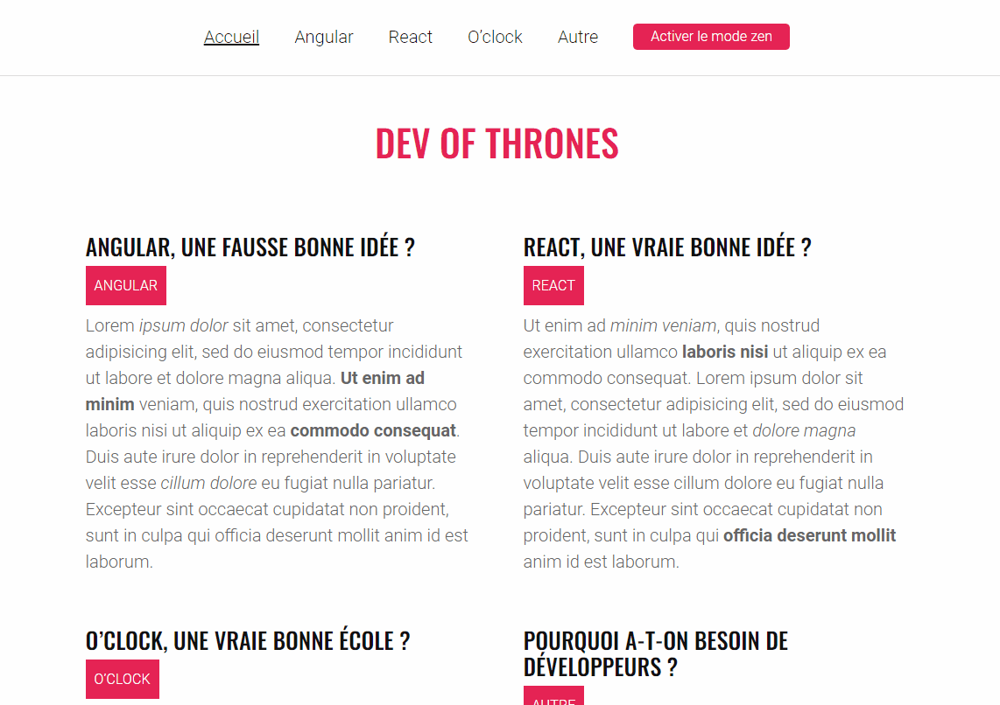

# Blog React

## About

This is a quite simple project that helps me to experiment React and Typescript :

- the uses of types
- making react components and passing props
- routing with [React-Router](https://reactrouter.com/en/main)
- navigating with [React-Router-DOM](https://reactrouter.com/en/main/components/nav-link)
- the uses of React hooks
- creating custom hooks
- making API requests and handling the reponse
- how to safely set HTML content (sanitize)

All this in a [Vite](https://vitejs.dev/) environment.

## Install locally

1. install `pnpm i`
2. try it `pnpm run dev`

